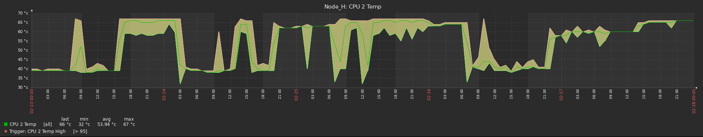

# zabbix-templates
Templates for the Zabbix open-source monitoring platform

Minimum Zabbix Version: 4.0

Monitor all sensors available through IPMI: peripherals temperatures and voltages, FAN's RPM, Power Supply Units and CMOS status

Templates for devices:
 - Fortinet Fortigate (tested with FG200E) using SNMPv3
 - A+ Servers with H11DST-B motherboard (4x nodes) - https://www.supermicro.com/en/products/motherboard/H11DST-B
 - A+ Servers with H11SSL motherboard (storage) - https://www.supermicro.com/en/products/motherboard/H11SSL-i
 - Servers with X11SCH-F motherboard - https://www.supermicro.com/en/products/motherboard/x11sch-f
 - Servers with X11SCL-F motherboard - https://www.supermicro.com/en/products/motherboard/X11SCL-F

